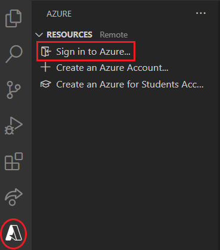

# Prerequisites

1. [Azure Functions Core v4](https://docs.microsoft.com/en-us/azure/azure-functions/functions-run-local?tabs=v4%2Cwindows%2Ccsharp%2Cportal%2Cbash#install-the-azure-functions-core-tools)
    - To confirm installation, type `func -v` in a terminal. The output should be a version number in the following format `4.X.X`.
2. [.Net 6 SDK](https://dotnet.microsoft.com/download)
    - To confirm installation type `dotnet --version` in a terminal. The output should be a version number in the following format `6.X.X`.
3. [Visual Studio Code](https://code.visualstudio.com/)
4. [Azure Functions extension for VS Code](https://marketplace.visualstudio.com/items?itemName=ms-azuretools.vscode-azurefunctions)
    - To confirm installation, look for the following installed installations in the extensions tab in VS Code: Azure Account, Azure Functions, Azure Resources.
5. [C# extension for VS Code](https://marketplace.visualstudio.com/items?itemName=ms-dotnettools.csharp) 
    - To confirm installation, look for C# in the extensions-tab in VS Code.
6. An active Azure account. Create a [free account](https://azure.microsoft.com/en-us/free)

We recommend that a folder is created to contain all of the function created in the workshop.

## Setting up a development environment

1. Create a folder that will contain all of the functions created in the workshop
e.g. `learning-functions`
2. Open Visual Studio Code and open the newly created folder by selecting `Open folder` in the `File` menu.

We will now be connecting VS Code to your Azure Account
    
3. In the side menu select the Azure icon and click `Sign in to Azure...` in the `Resources` section. 

Follow the instructions to sign in to your account.

Congratulations, you are now ready to start developing your first Azure functions!
