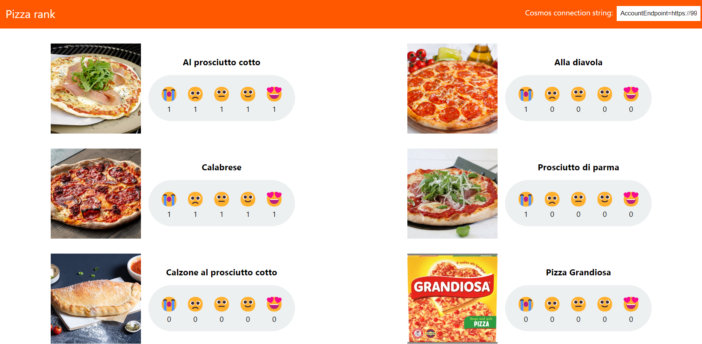
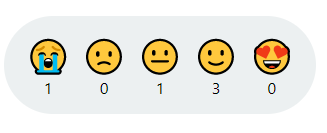
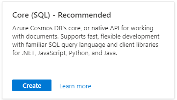
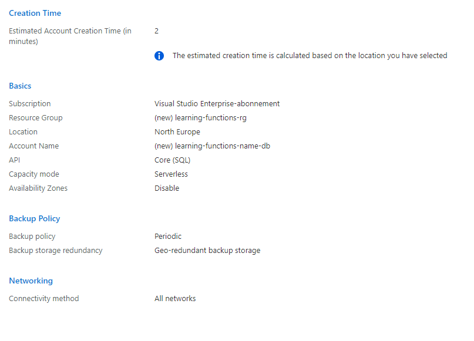
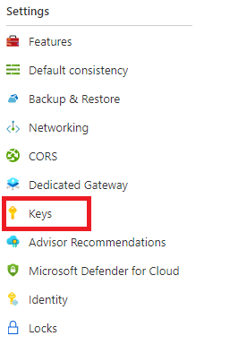
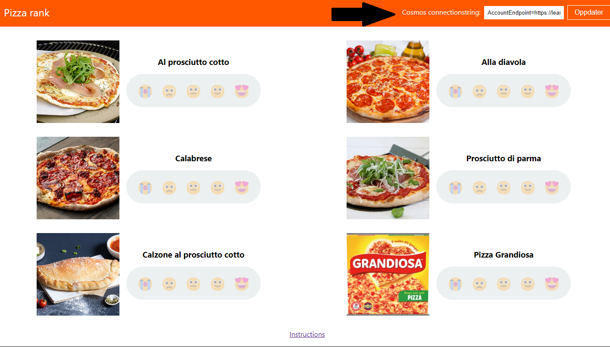
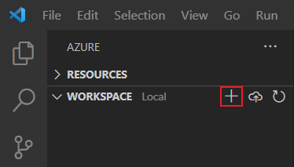
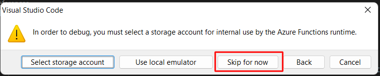

## Creating an Azure Function with a Cosmos DB trigger

In this task we will be creating an Azure Functions with a Cosmos DB trigger.
Cosmos DB is a fully managed NoSQL database for modern app development. As with all databases you can read, insert, update and delete elements in it. Including a Cosmos DB trigger to a function will result in the function being executed whenever a document is inserted or updated in the database.

### The case

In this task you will be working with a [website for rating pizza](https://pizzaapp.z1.web.core.windows.net/). The site collects ratings for various pizzas and users can rate each pizza using emojis. Each emojis translates into a score between 0 to 4 and the rating is stored in Cosmos DB. Your task is to create an Azure Function that is executed whenever a new rating is given on the web site.





For the purpose of this workshop, each instance of the website will store the ratings in a database determined by the user. This way, you can test your function by adding a rating to the site and these only being registered in your database, hence only triggering _your_ function.

For the website to identify your database, you will have to provide the connection string to your database.

The case will be completed in three steps

1. **Setting up a database in Azure**: This database will be set up in your personal account and is where the pizza ratings will be persisted.
2. **Connect your database to the pizza site**
3. **Setting up the function based on the template**
4. **Modifying the template to fit your needs**
5. **Deleting Azure resources**

### Set up database in Azure

You can either set up a free sandbox database
or a database in your personal Azure Directory.

{}

1. In a browser go to https://cosmos.azure.com/try/
2. Click `Select` for `Core (Reccommended)`
   
3. Complete the sign in process using a Microsoft or GitHub account.
4. Once successfully signed in, click `Open in portal`

{}

{}

1. In a browser, go to https://portal.azure.com
2. Type in `Cosmos DB` in the search bar and select the _Azure Cosmos DB_ service


3. Click `Create` and select the Create for the _Core (SQL) API_



4. Set the basic configurations for the database

- **Resource group**: `learning-functions-rg`
- **Account Name**: `learning-functions-[insert initials]-db`
- **Location**: `(Europe) North Europe`
- **Capacity mode**: `Serverless`

5. Click review and Create


{}

6. Once validation has passed. Click create.

While your database is being provisioned enjoy a coffee break! :)

### Connect the pizza site to your new database

1. In a browser, navigate to the Azure Portal and open your newly created Cosmos DB resource.
2. In the left menu under _Settings_ click `Keys`.
   
3. Copy the read-write primary connection string. This will be required as input in the pizza site.
4. In a browser, go to https://pizzaapp.z1.web.core.windows.net/
5. In your db connection string into the input box in the upper right corner and click `Update`
   

You should now be able to add ratings to the pizzas on the website. Which one is your favorite?

In the next step we will be creating the function that will respond to the inputting of ratings on this site.

### Create a new Azure Function

1. In VS Code, under the `Workspace` section of the Azure extension, select `Add` and `Create Function`.



You will now be prompted for configurations for the project and login to Azure. Input the following values:

[TODO: go through steps and confirm what needs to be selected][note: could we have a file ready for them where they only need to replace certain parts of the code? ]

- **Template for function**: Azure Cosmos DB trigger

- **Function name**: CosmosTriggerFunction

- **Namespace**: LearningFunctions.CosmosTriggerFunction

- **Storage settings**: AzureWebJobsStorage

- **Database name**: storage

- **Collection name**: ratings\_[INSERT GUID] e.g. `ratings_88a3175c-310a-45b4-920d-c0576f617e5d`

- **Storage account prompt**: Use local emulator

  

Your function is now being set up and a file `CosmosTriggerFunction.cs` will be added to your folder.

### Complete setup of function

1. In `local.settings.json` you will now be adding a new property to the values section.

<details open markdown="block">
  <summary>
  New settings property
  </summary>
    "CosmosConnection": "AccountEndpoint=https://abakus-workshop.documents.azure.com:443/;AccountKey=XnSfxZw1Npwzw5oDg1OvIDzBpX8h9KirkDLTsghy7myFCyW3YmOdyVIIyB0bINwmQju0UxIE6aN7C8CKhNK05w==;"
</details>

2. Complete the trigger configuration in `CosmosTriggerFunction.cs`

   The `Run` function has a configuration for the Cosmos DB trigger,
   but it is not yet complete.

   ```cs
   [CosmosDBTrigger(
           databaseName: "storage",
           collectionName: "ratings_[INSERT GUID]", // insert your guid here
           ConnectionStringSetting = "",
           LeaseCollectionName = "leases")]
   ```

   - Ensure that database name is set to `storage`, and that the collection name is set to `ratings_[GUID]`.

   - The value of `ConnectionStringSetting` should be `"CosmosConnection"`. This refers to the value that was included in local.settings.json

   - Change the value of `LeaseCollectionName` from _leases_ to `"leases_[GUID]"` Remember to insert your custom guid.

   The fully configured attribute should look like this
   "

   ```cs
   [CosmosDBTrigger(
           databaseName: "storage",
           collectionName: "ratings_88a3175c-310a-45b4-920d-c0576f617e5d",
           ConnectionStringSetting = "CosmosConnection",
           LeaseCollectionName = "leases_88a3175c-310a-45b4-920d-c0576f617e5d")]
   ```

3) Add rating model class to be used by the function

   In `CosmosTriggerFunction.cs`, replace the class `MyDocument` with the model for rating

   ```cs
   public class Rating
   {
     public Guid Id { get; set; }

     public int PizzaId { get; set; }

     public int Score { get; set; }

     public DateTime Created { get; set; }
   }
   ```

   and change type for input from `IReadOnlyList<MyDocument>` to `IReadOnlyList<Rating>`

4) Run the function

   Your function should now be ready to go and you can run it by typing the cmd `func start` in the terminal.

   Each time a rating is given on the web site, you should see activity in your console.

**Question**

The template function only accesses the first element in the input collection. In what cases would the collection hold more than one element?

### Modify Cosmos DB Trigger function

1. Ensure that all changes to the ratings results in a log line in the console.

   _Hint_: Try looping through the input collection with a _ForEach_ loop.

   [Code hint](https://github.com/acn-sbuad/avanade-workshop/tree/main/hints/CosmosDbTriggerFunction/ModifyCosmosDbFunction/logAllChanges)

2. Print the content of the rating in the console.

   To convert the input object to a rating element by casting it.

   ```cs
   Rating r = (Rating) input[i];
   ```

   _Hint_: Use System.Text.Json.JsonSerializer to serialize the rating object to a json string.

   [Code hint](https://github.com/acn-sbuad/avanade-workshop/tree/main/hints/CosmosDbTriggerFunction/ModifyCosmosDbFunction/printContent)

3. Print a different string to the console depending of the score of the rating.

   _Hint_: Use a switch case.

[Code hint](https://github.com/acn-sbuad/avanade-workshop/tree/main/hints/CosmosDbTriggerFunction/ModifyCosmosDbFunction/printStringBasedOnScore)

### Deleting Azure resources

When testing in Azure, always remember to delete the resources once you're done as they might keep generating costs and draining your account for credits.

[TODO]
