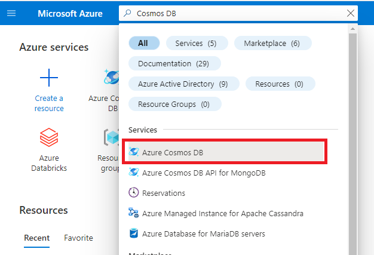
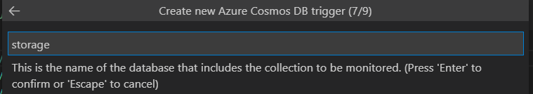

TODO: Work through all tasks.

## Creating an Azure Function with a Cosmos DB trigger

In this task we will be creating an Azure Functions with a Cosmos DB trigger.
Cosmos DB is a fully managed NoSQL database for modern app development. As with all databases you can read, insert, update and delete elements in it. Including a Cosmos DB trigger to a function will result in the function being executed whenever a document is inserted or updated in the database.

### Table of contents

[The case](#the-case)

[Set up database in Azure](#set-up-database-in-azure)

[Connect the pizza site to your new database](#connect-the-pizza-site-to-your-new-database)

[Create a new Azure Function](#create-a-new-azure-function)

[Complete setup of function](#complete-setup-of-function)

[Modify Cosmos DB trigger function](#modify-cosmos-db-trigger-function)

### The case

In this task you will be working with a [website for rating pizza](https://pizzaapp.z1.web.core.windows.net/). The site collects ratings for various pizzas and users can rate each pizza using emojis. Each emojis translates into a score between 0 to 4 and the rating is stored in Cosmos DB. Your task is to create an Azure Function that is executed whenever a new rating is given on the web site.


For the purpose of this workshop, each instance of the website will store the ratings in a database determined by the user. This way, you can test your function by adding a rating to the site and these only being registered in your database, hence only triggering _your_ function.

For the website to identify your database, you will have to provide the connection string to your database.

The case will be completed in four steps

1. **Setting up a database in Azure**: This database will be set up in your personal account and is where the pizza ratings will be persisted.
2. **Connect your database to the pizza site**
3. **Setting up the function based on the template**
4. **Modifying the template to fit your needs**

### Set up database in Azure

In this section, you are given _two_ options on how to set up the database.

**NOTE** If you have credits in you Azure account go for option A.

- A - Set up a database in an Azure Subscription you control
- B - Set up a free sandbox database in Azure

**Alternative A: Create a database in an Azure Subscription you control**

1. In a browser, go to the [Azure portal](https://portal.azure.com)
2. Type in `Cosmos DB` in the search bar and select the _Azure Cosmos DB_ service

   

3. Click `Create` and select the Create for the _Core (SQL) API_

   

4. Set the basic configurations for the database

   - **Resource group**: `learning-functions-rg`
   - **Account Name**: `learning-functions-[insert initials]-db`
   - **Location**: `(Europe) North Europe`
   - **Capacity mode**: `Serverless`

5. Click review and Create

   

6. Once validation has passed. Click create.

While your database is being provisioned enjoy a coffee break! :)

**Alternative B: Create a database in a sandbox environment**

1. In a browser go to https://cosmos.azure.com/try/
2. Click `Select` for `Core (Recommended)`
   
3. Complete the sign in process using a Microsoft or GitHub account.
4. Once successfully signed in, click `Open in portal`

### Connect the pizza site to your new database

1. In a browser, navigate to the Azure Portal and open your newly created Cosmos DB resource.

2. In the left menu under _Settings_ click `Keys`.
   

3. Copy the read-write primary connection string. This will be required as input in the pizza site.

4. In a browser, go to https://pizzaapp.z1.web.core.windows.net/

5. In your db connection string into the input box in the upper right corner and click `Update`
   

You should now be able to add ratings to the pizzas on the website. Which one is your favorite?

You should see a new container `ratings` in your database containing the pizza ratings


In the next step we will be creating the function that will respond to the inputting of ratings on this site.

### Create a new Azure Function

1. In VS Code, under the `Workspace` section of the Azure extension, select `Add` and `Create Function`.


You will now be prompted for configurations for the project and login to Azure. Input the following values:

- **1. Template for function**: Azure Cosmos DB trigger

- **2. Function name**: RatingTrigger

- **3. Namespace**: LearningFunctions.RatingTrigger

- **4. App settings**: Create new local app settings
  

- **5. Select the Azure subcription with the cosmos database**: If you are using the demo cosmos database instance use "Microsoft Azure Sponsorship"
  

- **6. Select the Comsos account to use**:
  The name of the cosmos demo account is randomly generated
  

- **7. Set the database name to "storage"**
  ("Storage" is the name of database created by the pizza ranker API)
  

- **8. Set the collection name to "ratings"**
  ("Storage" is the name of container created by the pizza ranker API)
  

If promted for storage account. Press "Skip for now", it is not needed for this workshop.


Your function has now been setup. Your `local.settings.json` should be updated with your cosmos connection string and a file `RatingTrigger.cs` added to your project folder.

`RatingTrigger.cs` is the function trigger. Within the `CosmosDBTrigger` attribute you should be able to see the values configured in the previous steps.

### Running the function

Your function should now be ready to go and you can run it by typing the cmd `func start` in the terminal.

Each time a rating is given on the web site, you should see activity in your console with the number of documents modified.

**Question**

The template function only accesses the first element in the input collection. In what cases would the collection hold more than one element?

### Challenge: Modifying the output

Are you able to modify the trigger to log a special message if a pizza gets the best rating(😍)?

### Modify Cosmos DB Trigger function

1. Ensure that all changes to the ratings results in a log line in the console.

   _Hint_: Try looping through the input collection with a _ForEach_ loop.

   [Code hint](https://github.com/acn-sbuad/learning-functions/tree/task-description/hints/CosmosDbTriggerFunction/ModifyCosmosDbFunction/logAllChanges)

2. Print the content of the rating in the console.

   _Hint_: The toString() method on the element will return a json representation of the entry.

   [Code hint](https://github.com/acn-sbuad/learning-functions/tree/task-description/hints/CosmosDbTriggerFunction/ModifyCosmosDbFunction/printContent)

3) Print a a special message if a pizza gets the best rating(😍)

   _Hint_: Use `JsonSerializer` from the `System.Text.Json` namespace to deserialize the input from the trigger to a rating object

   ```cs
   public class Rating
   {
     public Guid id { get; set; }

     public int pizzaId { get; set; }

     public int score { get; set; }

     public DateTime created { get; set; }
   }
   ```

   [Code hint](https://github.com/acn-sbuad/learning-functions/tree/task-description/hints/CosmosDbTriggerFunction/ModifyCosmosDbFunction/printStringBasedOnScore)
