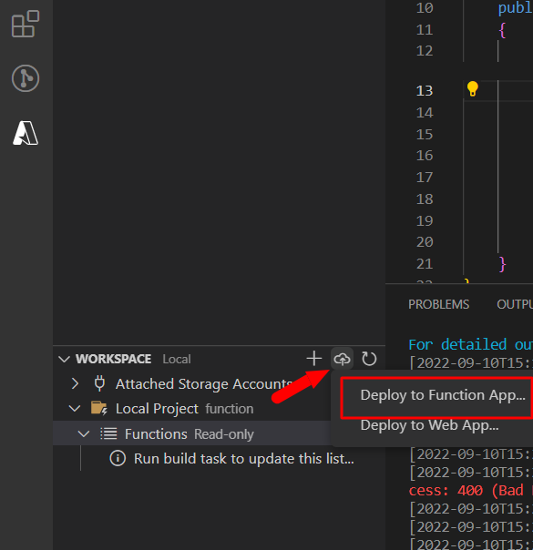
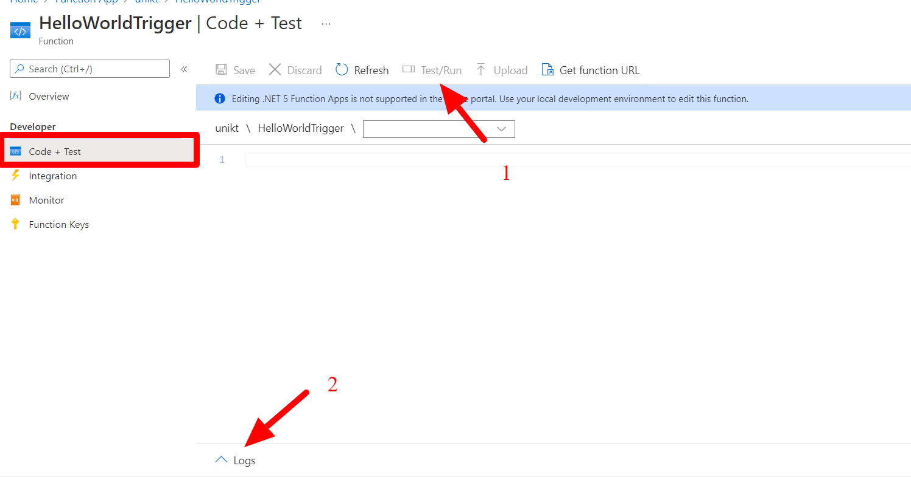

## Deploying the functions to Azure

Until now you have been running the functions locally. In this task, you will deploy the functions you've made to Azure.

### Table of contents

[Publishing function app from VS Code](#publishing-function-app-from-vs-code)

[Trigger the HTTP function through the portal](#trigger-the-http-function-in-azure-portals)

[Deleting Azure resources](#deleting-azure-resources)

### Publishing function app from VS Code

This step describes how deploy the function to Azure.

When prompted to configure your function select:

1. **Create new function app in Azure..**
2. Name: **Pick a globally unique name**
3. Runtime stack: **.NET 6**
4. Location: **Norway East**

Once the creation process is complete you should be able see your newly created function app in the [Azure Portal](https://portal.azure.com/#blade/HubsExtension/BrowseResource/resourceType/Microsoft.Web%2Fsites/kind/functionapp).

**Deploy the code to your newly created function app**

### Trigger the HTTP function in Azure portals

In order to trigger a function navigate to the trigger:

Then click "Code + Test"

From the "Code + Test" view you can trigger functions (1) and see live logs(2).

### Deleting Azure resources

When testing in Azure, always remember to delete the resources once you're done as they might keep generating costs and draining your account for credits.

[TODO]
