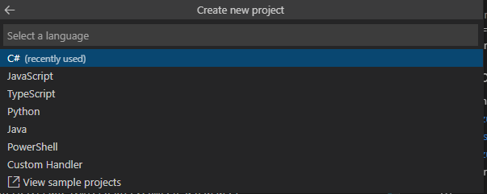
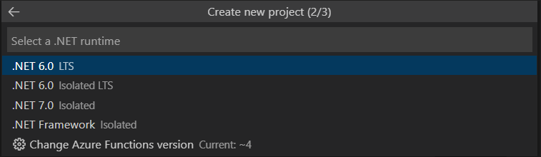
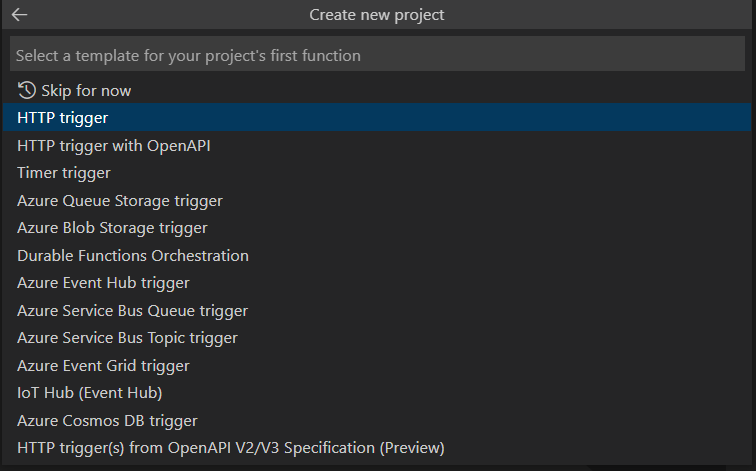
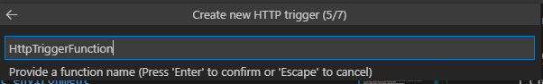
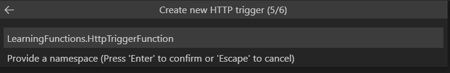
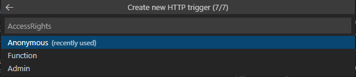
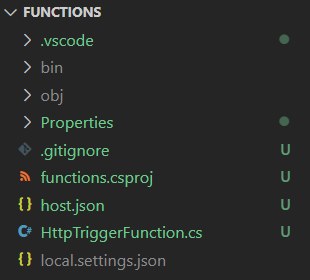
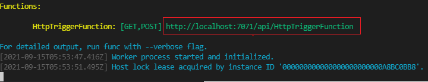

TODO: double check all hints

## Creating an Azure Function with an HTTP trigger

In task 1 you will be setting up an Azure Function with an HTTP trigger.

We use functions with an HTTP trigger if you want the function to run whenever a request is sent to the endpoint the function is exposed on. This could be useful to serve serverless APIs or to respond to webhooks.

### Table of contents

[Set up the Azure Function APp](#set-up-the-azure-function-app)

[The project files](#the-project-files)

[Run the template project](#run-the-template-project)

[Modifying the HTTP trigger function](#modifying-the-http-trigger-function)

### Set up the Azure Function App

The Azure Functions extension in VS Code lets you create a function app project, along with your first function.

1. In VS Code, under the `Workspace` section of the Azure extension, select `Add` and `Create Function`.

   

2. You will now be given the option of creating a function project, select yes.

   

Going forward you will not be prompted for configurations for the project. Input the following values:

- **Language**: C#

  

- **.NET runtime**: .NET 6 (LTS)
  

- **Template for first function**: HTTP trigger

  

- **Function name**: HttpTriggerFunction

  

- **Namespace**: LearningFunctions.HttpTriggerFunction

  

- **Access rights**: Anonymous

  

Your project and first function is now being set up and a number of files will be created in the folder.

### The project files

Your workshop folder should look like this



A number of files are generated, for the most part they will be left as is, but there are two files you will need to edit.

- `local.settings.json` holds the settings for running the function locally and you will be updating this later in the workshop.

- `HttpTriggerFunction.cs` contains the function.

```cs
[FunctionName("HttpTriggerFunction")]
public static async Task<IActionResult> Run(
    [HttpTrigger(AuthorizationLevel.Anonymous, "get", "post", Route = null)] HttpRequest req,
    ILogger log)
{
    log.LogInformation("C# HTTP trigger function processed a request.");
    string name = req.Query["name"];
    string requestBody = await new StreamReader(req.Body).ReadToEndAsync();
    dynamic data = JsonConvert.DeserializeObject(requestBody);
    name = name ?? data?.name;
    string responseMessage = string.IsNullOrEmpty(name)
        ? "This HTTP triggered function executed successfully. Pass a name in the query string or in the request body for a personalized response."
        : $"Hello, {name}. This HTTP triggered function executed successfully.";
    return new OkObjectResult(responseMessage);
}
```

The functions first input parameter has an attribute `[HttpTrigger(...)]` that specifies that the function response to an `http trigger`.

The function supports both `HTTP GET` and `HTTP POST` requests, no authorization is required and no route is defined.
The input is an `HttpRequest` object and an `ILogger` object.

Each time the function is triggered, a text string is written to the console and a text string is returned to the client.

**Question**

Which text string will appear in the console and which text string will appear in the browser?

Not quite sure? Go on to the next step to find out!

### Run the template project

The auto created function is ready to run as is, let's test that everything is set up ok.

1. Open a new terminal in VS Code
2. Navigate to the project folder and run cmd `func start`

If everything is successful the output in the terminal should look like this



Navigate to the url displayed in the terminal to see your function.

### Modifying the HTTP trigger function

Run the cmd `func start` after each step to see the results.

1. Hard coded response.

   In the case no name is passed to the function, change the text in the response from
   `This HTTP triggered function executed successfully. Pass a name in the query string or in the request body for a personalized response.`
   to `Welcome to my first Azure Function!`

   [Code hint](https://github.com/acn-sbuad/avanade-workshop/tree/main/hints/HttpTriggerFunction/ModifyHttpTrigger/hardcodedResponse)

2. Accessing query parameters

   The function template retrieves a single query parameter _name_.
   Can you extend the function to process two query parameters `name` and `company`?

   Use the parameters to print a response to the user in the following format:

   `Hello, [name]. Are you ready for this workshop with [company]?`

   _Hint_: To send a query parameter to the function add `?{parameterName}={parameterValue}` at the end of the url. E.g. `http://localhost:7071/api/HttpTriggerFunction?company=Avanade` If you want to send multiple parameters separate them with `&`.

   [Code hint](https://github.com/acn-sbuad/avanade-workshop/tree/main/hints/HttpTriggerFunction/ModifyHttpTrigger/accessQueryParam)

3. Returning dynamic data

   Instead of printing a hard coded string, can you make the function return the current time?

   _Hint_: In C#, the DateTime object is defined in the `System` namespace. To get the current date use `System.DateTime.Now`.

   [Code hint](https://github.com/acn-sbuad/avanade-workshop/tree/main/hints/HttpTriggerFunction/ModifyHttpTrigger/dynamicResponse)

**Question**
During the configuration of the function we set the access rights to `anonymous`.
Other available options are `Function` and `Admin` when would you use these two configurations?
