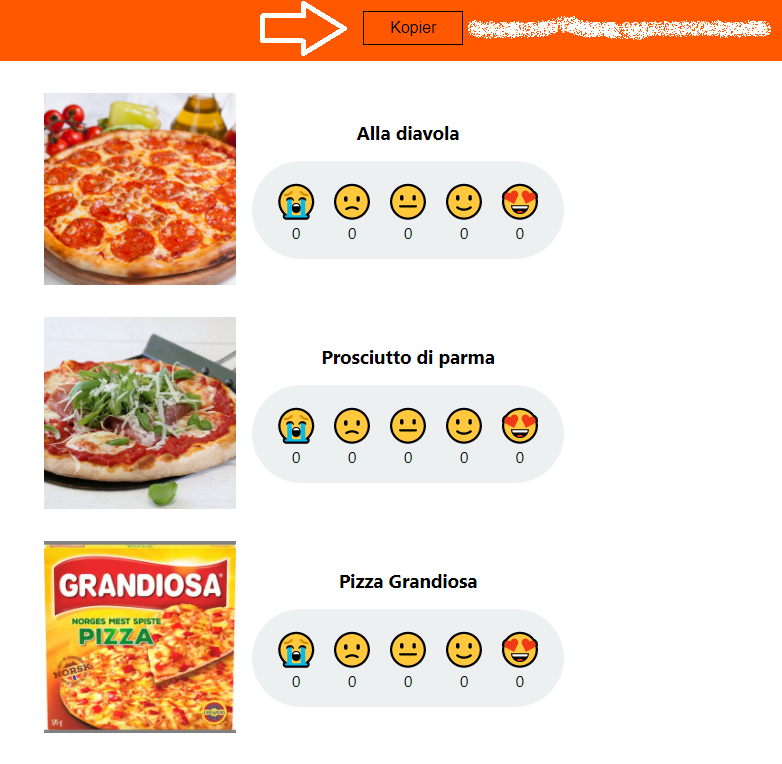

## Set up database in Azure

##  Creating an Azure Function with a Cosmos DB trigger

In this and future tasks, you will be working with a [website for rating pizza](https://pizzaapp.z1.web.core.windows.net/). The site collects ratings for various pizzas and users can give a score from 0 to 4. The ratings are stored in an Azure Cosmos DB. Cosmos DB is a fully managed NoSQL database for modern app development.

    


    


Your task will be to create an Azure Function that is triggered each time a new rating is given on the site. This can be done using a Azure function with a Cosmos DB trigger.

For the purpose of this workshop, each instance of the site stores the ratings in a separate collection in Cosmos DB. This way, you can test you function by adding a rating to the site, and it only triggers your function.

Your individual resources will be identified by using the GUID displayed in the top right corner of the website. 

    

Keep this GUID handy and insert it everywhere in the description where `[INSERT GUID]` is mentioned.

### Create a new Azure Function

1. In VS Code, under the `Workspace` section of the Azure extension, select `Add` and `Create Function`.


You will now be prompted for configurations for the project and login to Azure. Input the following values:

[TODO: go through steps and confirm what needs to be selected]
[Note: Could we have a file ready for them where they only need to replace certain parts of the code? ]
- **Template for function**: Azure Cosmos DB trigger

- **Function name**: CosmosTriggerFunction

- **Namespace**: LearningFunctions.CosmosTriggerFunction

- **Storage settings**: AzureWebJobsStorage

- **Database name**: storage

- **Collection name**: ratings_[INSERT GUID] e.g. `ratings_88a3175c-310a-45b4-920d-c0576f617e5d`

- **Storage account prompt**: Use local emulator

    

Your function is now being set up and a file `CosmosTriggerFunction.cs` will be added to your folder.

### Complete setup of function

1. In `local.settings.json` you will now be adding a new property to the values section. 

<details open markdown="block">
  <summary>
  New settings property
  </summary>
    "CosmosConnection": "AccountEndpoint=https://abakus-workshop.documents.azure.com:443/;AccountKey=XnSfxZw1Npwzw5oDg1OvIDzBpX8h9KirkDLTsghy7myFCyW3YmOdyVIIyB0bINwmQju0UxIE6aN7C8CKhNK05w==;"
</details>
   

2. Complete the trigger configuration in `CosmosTriggerFunction.cs`

    The `Run` function has a configuration for the Cosmos DB trigger,
    but it is not yet complete. 

    ```cs
    [CosmosDBTrigger(
            databaseName: "storage",
            collectionName: "ratings_[INSERT GUID]", // insert your guid here
            ConnectionStringSetting = "",
            LeaseCollectionName = "leases")]
    ```

    - Ensure that database name is set to `storage`, and that the collection name is set to `ratings_[GUID]`.

    - The value of `ConnectionStringSetting` should be `"CosmosConnection"`. This refers to the value that was included in local.settings.json

    - Change  the value of `LeaseCollectionName` from _leases_ to `"leases_[GUID]"` Remember to insert your custom guid.

    The fully configured attribute should look like this
    "
    ```cs
    [CosmosDBTrigger(
            databaseName: "storage",
            collectionName: "ratings_88a3175c-310a-45b4-920d-c0576f617e5d",
            ConnectionStringSetting = "CosmosConnection",
            LeaseCollectionName = "leases_88a3175c-310a-45b4-920d-c0576f617e5d")]
    ```
   

3. Add rating model class to be used by the function

    In `CosmosTriggerFunction.cs`, replace the class `MyDocument` with the model for rating

    ```cs
    public class Rating
    {
        public Guid Id { get; set; }

        public int PizzaId { get; set; }

        public int Score { get; set; }

        public DateTime Created { get; set; }
    }
    ```

    and change type for input from `IReadOnlyList<MyDocument>` to `IReadOnlyList<Rating>` 

4. Run the function

    Your function should now be ready to go and you can run it by typing the cmd `func start` in the terminal.

    Each time a rating is given on the web site, you should see activity in your console.

**Question**

The template function only accesses the first element in the input collection. In what cases would the collection hold more than one element?

### Modify Cosmos DB Trigger function

1. Ensure that all changes to the ratings results in a log line in the console. 
  
    _Hint_: Try looping through the input collection with a _ForEach_ loop.

    [Code hint](https://github.com/acn-sbuad/avanade-workshop/tree/main/hints/CosmosDbTriggerFunction/ModifyCosmosDbFunction/logAllChanges)    

2. Print the content of the rating in the console. 

    To convert the input object to a rating element by casting it.
    
    ```cs
    Rating r = (Rating) input[i];
    ```

    _Hint_: Use System.Text.Json.JsonSerializer to serialize the rating object to a json string.

    [Code hint](https://github.com/acn-sbuad/avanade-workshop/tree/main/hints/CosmosDbTriggerFunction/ModifyCosmosDbFunction/printContent)    
    
3. Print a different string to the console depending of the score of the rating. 

    _Hint_: Use a switch case.

  [Code hint](https://github.com/acn-sbuad/avanade-workshop/tree/main/hints/CosmosDbTriggerFunction/ModifyCosmosDbFunction/printStringBasedOnScore)    
